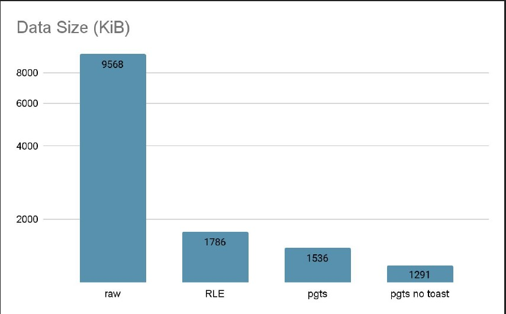

## pgts
Archive your time series in PostgreSQL as a professional.

## How is works?

This project is a set of encoders, currently pgts has the [double-delta encoding](https://www.slideshare.net/OliverMoser5/double-delta-encoding-lightning-talk-for-infracoders-3)
and a warpper for [zstd compression](https://github.com/facebook/zstd)

Unlike to other time series database, pgts does not provides a complete storage engine, but it can be embedded to any database which support User Defined Function. pgts is committed to providing a quick demo environment to demonstrate the power of time series coding.

There are only two API in pgts, it is very simle.

```sql
ts.u8_encode(array[/* 64bit integer array */]); -- d = zstd(DeltaOfDelta(raw data))
ts.u8_decode(/* bytes from ts_u8_enode */); -- decompress the data from encode()
```

For more implementation details please see the [hackday slide](./doc/gphackday2022-pgts.pdf)

## How to use?

example: there is a table like this:

```sql
CREATE TABLE gpmetrics.gpcc_system_history (
    ctime timestamp(0) without time zone,
    hostname character varying(64),
    mem_total bigint,
    mem_used bigint,
    mem_actual_used bigint,
    mem_actual_free bigint,
    swap_total bigint,
    swap_used bigint,
    swap_page_in bigint,
    swap_page_out bigint,
    cpu_user double precision,
    cpu_sys double precision,
    cpu_idle double precision,
    load0 double precision,
    load1 double precision,
    load2 double precision,
    quantum integer,
    disk_ro_rate bigint,
    disk_wo_rate bigint,
    disk_rb_rate bigint,
    disk_wb_rate bigint,
    net_rp_rate bigint,
    net_wp_rate bigint,
    net_rb_rate bigint,
    net_wb_rate bigint,
    cpu_iowait double precision DEFAULT 0
)
```

use this SQL to archive the data

```sql
create table x as
select
  hostname,
  ts.timestamp_encode( array_agg(   ctime                     order by ctime) ) as ctime,
  ts.u8_encode(        array_agg(   mem_total                 order by ctime) ) as mem_total,
  ts.u8_encode(        array_agg(   mem_used                  order by ctime) ) as mem_used,
  ts.u8_encode(        array_agg(   mem_actual_used           order by ctime) ) as mem_actual_used,
  ts.u8_encode(        array_agg(   mem_actual_free           order by ctime) ) as mem_actual_free,
  ts.u8_encode(        array_agg(   swap_total                order by ctime) ) as swap_total,
  ts.u8_encode(        array_agg(   swap_used                 order by ctime) ) as swap_used,
  ts.u8_encode(        array_agg(   swap_page_in              order by ctime) ) as swap_page_in,
  ts.u8_encode(        array_agg(   swap_page_out             order by ctime) ) as swap_page_out,
  ts.u8_encode(        array_agg(   (cpu_user*100000)::bigint order by ctime) ) as cpu_user,
  ts.u8_encode(        array_agg(   (cpu_sys*100000)::bigint  order by ctime) ) as cpu_sys,
  ts.u8_encode(        array_agg(   (cpu_idle*100000)::bigint order by ctime) ) as cpu_idle,
  ts.u8_encode(        array_agg(   (load0*100)::bigint       order by ctime) ) as load0,
  ts.u8_encode(        array_agg(   (load1*100)::bigint       order by ctime) ) as load1,
  ts.u8_encode(        array_agg(   (load2*100)::bigint       order by ctime) ) as load2,
  ts.u8_encode(        array_agg(   quantum                   order by ctime) ) as quantum,
  ts.u8_encode(        array_agg(   disk_ro_rate              order by ctime) ) as disk_ro_rate,
  ts.u8_encode(        array_agg(   disk_wo_rate              order by ctime) ) as disk_wo_rate,
  ts.u8_encode(        array_agg(   disk_rb_rate              order by ctime) ) as disk_rb_rate,
  ts.u8_encode(        array_agg(   disk_wb_rate              order by ctime) ) as disk_wb_rate,
  ts.u8_encode(        array_agg(   net_rp_rate               order by ctime) ) as net_rp_rate,
  ts.u8_encode(        array_agg(   net_wp_rate               order by ctime) ) as net_wp_rate,
  ts.u8_encode(        array_agg(   net_rb_rate               order by ctime) ) as net_rb_rate,
  ts.u8_encode(        array_agg(   net_wb_rate               order by ctime) ) as net_wb_rate,
  ts.u8_encode(        array_agg(  (cpu_iowait*100)::bigint   order by ctime) ) as cpu_iowait
from notts group by hostname;
```

and use this SQL to read the archived data.

```sql
select
  hostname,
  unnest(    ts.timestamp_decode(ctime)   )                 as ctime
from
  x
group by
  hostname,
  ctime
order by
  ctime;
```



## Future works

Current project is aimed to do POC of apply time series encoding to existing data. the POC has done and shows the power of time series encoding. 

But there are some features that still unimplemented, including [Gorilla encoding](https://www.vldb.org/pvldb/vol8/p1816-teller.pdf) and streaming API.

## License

MIT.
